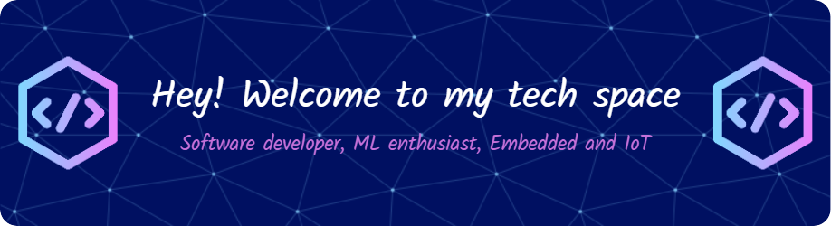

<h1 align="center">Hi 👋, I'm Samudra Uduwaka</h1>
<h3 align="center">A passionate undergraduate at the Department of Electronic and Telecommunication,   University of Moratuwa </h3>

  

Welcome to my GitHub profile! I'm currently an Engineering Undergratuate at the Department of Electronic and Telecommunication Engineering at the University of Moratuwa and a Software Engineering Undergratuate at Java Institute for Advanced Technology, Sri Lanka.  
I have a keen interest in Software Engineering, Machine Learning and IoT-based projects.

## About Me

- 🎓 **Education:**
  <ul>
    <li>Department of Electronic and Telecommunication Engineering, University of Moratuwa, Sri Lanka</li>
    <li>Software Engineering, Java Institute for Advanced Technology, Sri Lanka</li>
  </ul>
  
- 💻 **Skills:**
  <ul>
    <li>Languages: JavaScript, Java, PHP, HTML, React, Python, C++</li>
    <li>Frameworks: Bootstrap, Tailwind, Sementic UI</li>
    <li>Tools and Platforms: VSCode, Netbeans, Arduino, MATLAB, SOLIDWORKS</li>
  </ul>
- 🧠 **Machine Learning:**
  <ul>
    <li>I have experience working on machine learning projects using TensorFlow and SciPy.</li>
  </ul>
- 🌐 **Web Development:**
  <ul>
    <li>I have developed web apps and websites using JavaScript, PHP, CSS and HTML.</li>
  </ul>
- 🛠️ **Design:**
  <ul>
    <li>SolidWorks for designing enclosures and mechanical components.</li>
  </ul>

<h3 align="center">Languages and Tools:</h3>

 
   
   
   
   
   
   
   
   
   
   
   
   
   
   
   
   
   
   
   
   
   
   
   
   
   
   
   
   

## Projects

Here are some of the projects I've worked on:

<h4>Embedded and IoT</h4>

- **Smart Medi-box:** Developed a Smart Medicine Storage device with the integration of Node-red, C++, ESP32 module and some sensor modules. [View Repository](https://github.com/SamudraUduwaka/Medibox-Samudra.git)
- **Adaptive Traffic Control System:** Developed an Adaptive traffic light system which can update the time-to-wait at traffic-light junctions which has addressed the problem of Static time schedules for all the subways at the junction. Used IoT and ML models to implement. [View Repository](https://github.com/SamudraUduwaka/Adaptive-Traffic-Control-System.git)

<h4>Web Development</h4>

- **Php based Web App for a School Management System:** Built a web application using PHP, HTML, CSS and JavaScript to manage students, teachers and academic officers in a school. [View Repository](https://github.com/SamudraUduwaka/SuccessInternational-Web-App.git)
- **Php based Web App for an Online Tech store:** Built a web application using PHP, HTML, CSS and JavaScript for an Online store which can view, add to cart and can purchase through the site. [View Repository](https://github.com/SamudraUduwaka/NewTech-php-Web-Application.git)

<h4>Machine Learning</h4>

- **Machine Learning Models:** Implemented various machine learning models for tasks such as image classification, sentiment analysis, and predictive analytics using TensorFlow and SciPy. [View Repository](https://github.com/SamudraUduwaka/Machine-Learning.git)

## Get in Touch

Feel free to reach out to me for collaborations, project ideas, or just to connect!

- 📫 Reach me at **samudrauduwaka@gmail.com**
- 💬 Ask me anything on my preferences

<h3 align="left">Connect with me:</h3>

  
   

